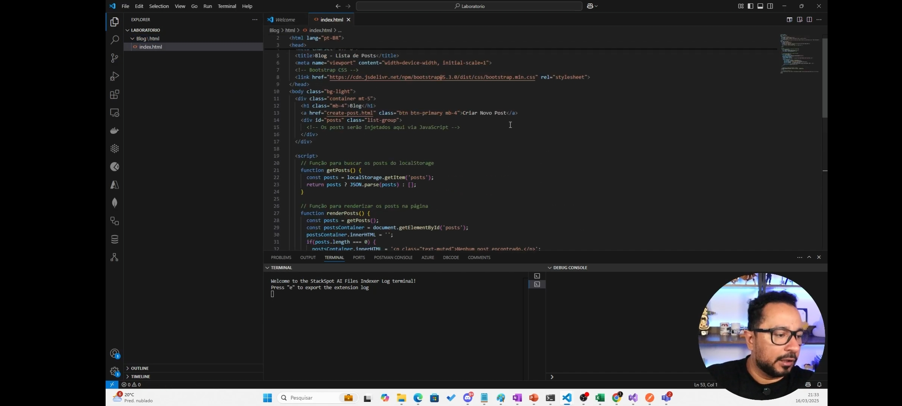
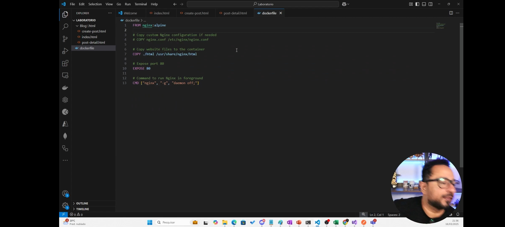
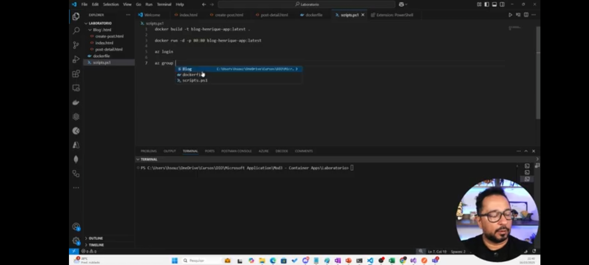
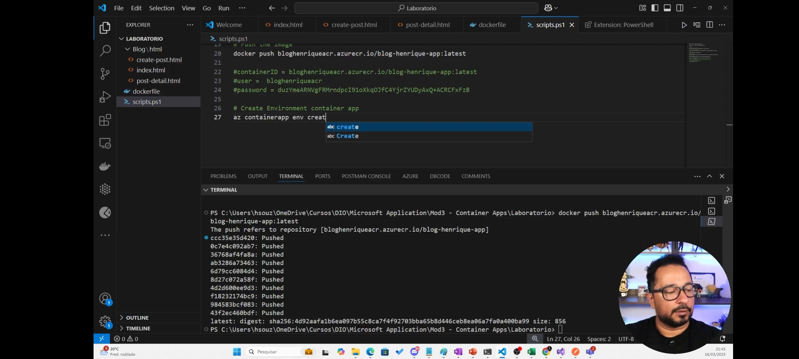
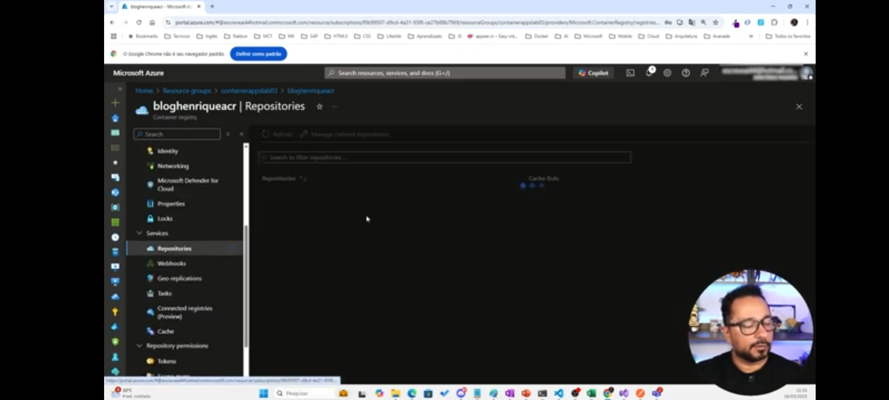

# azurecloudnative02
Desafio - Armazenando dados de um E-Commerce na Cloud
Com este desafio aprendi a como subir uma aplicação (blog) para o Azure Container Apps
Também como fazer o registro no Azure Container Registry e como utilizar o PowerShell
abixo estão os prints do passo a passo:

Subindo a aplicação no container app

Criando o docker file

Criando o Resource Group e o Container Registry

Login no ACR

Finalizando o projeto.
